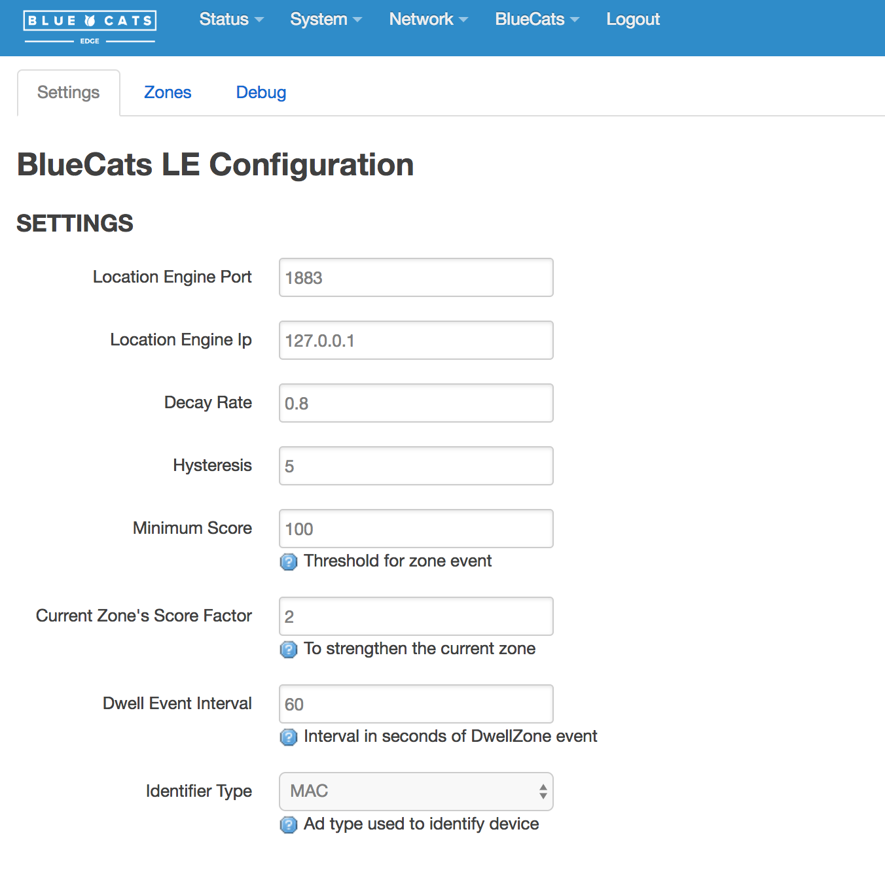

# Location Engine Configurations




There some concepts in location engine and its setup.

### Score

`score` is a positive float number that quantitively describes how far the BLE device is away from the Edge relay. The greater the `score` is, the closer the beacon is to the edge.

But how is a score worked out?

The short answer is `score` depends on the `rssi` of the beacon. Basicly it is calucated like this:

```c
score=pow(10, (127-rssi)/20)
```

I plot the curve here (from -107 to -47), download the original Excel Sheet [here](pics/rssi.xlsx):


### Decay rate

`Decay rate` is how much of the score will be remained in every second recalculating. Suppose `Decay rate` is `0.8` and a beacon was detected 2 seconds ago, the the current score of this beacon in the zone is:
```c
newScore = score * pow(0.8, 2)
```

### Hysteresis

`Hysteresis` is the minimum number of consective packets that the edge receives from a specific beacon before the edge is able to decide the beacon is in place. Suppose a beacon broadcasts at 1Hz speed, `hysteresis` reflects how soon the edge is able to make the decision of the beacon being stablly sitting in the range of the edge.

### Minimum score

`Minimum score` is a threshold on `score` before the edge is able to decide the beacon is in place. Typically, `Minimum score` and `Hysteresis` work together to make the decision.

### Score factor

`Score factor` is a weight applied to the current zone for the beacon. In the diagram below, the beacon is currently in Zone 2, and is moving towards to Zone 1, so Zone 1's score is increasing and Zone 2's score is decreasing. As we set `score factor` to `3`, so Zone 2 is still the winner zone even if its score is lower than `min score`.


### Dwell event interval
It is the interval of sending `DwellZone` event after `EnterZone` event or `ChangeZone` event. `0` to disable `DwellZone` event.

### Zone weight
In the second tab of the screen there are zones configurations. Each `Zone` have 1 or more readers aka Edge Relays. Each zone has a `Zone weight` which will apply to the `score` for all beacons in this zone.


