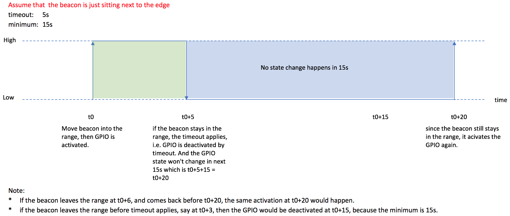

# Setup GPIO Actions for the Edge Relay

The Edge Relay is capable to trigger GPIO when some predefined conditions have been met.

## Fields of the config
| Field | Description |
| ---- | ----|
| Event Type | the source that triggers the GPIO, `BLE Scan Event` is sent by the embedded BLE scanner of the Edge Relay, while `Location Zone Event` is sent by the Location Engion of the Edge Relay(LE variant)|
| Select Filters (AND'd together) | filters help to choose which beacons would be used to trigger the GPIO actions,see [here]() for instructions |
| RSSI threshold | The GPIO would be triggered if the filtered beacon's RSSI is grater than this threshold. |
| GPIO pin number | Make sure to take an unused GPIO, refer to [the PCB layout of GL_AR150](https://wiki.openwrt.org/_media/media/gl.inet/gl_ar150_marks.jpg?cache=). Ernie's gist showing how to reuse the Edge's LED to test GPIO actions is a good start too. The main point of reusing LED GPIO(e.g. #13) is to run `echo "leds-gpio" > /sys/bus/platform/drivers/leds-gpio/unbind` in the edge via ssh.|
| GPIO goes high/low on activate | Which is the activated state? |
| Timeout in seconds to deactivate | Normally the GPIO will be deactivated if the beacons move away, but if the beacon doesn't move away, this timeout would be used to deactivate the GPIO |
| Minimum number seconds before changing gpio state | The minimum time span between two actions i.e. activate and deactivate |

## Then, what is expected to come out?

The short answer is it depends on the value of `Timeout in seconds to deactivate` and `Minimum number seconds before changing gpio state` in the config above.

Here are 2 examples of the combination, keep in mind that when `Timeout` happens, the `minimum seconds` won't be checked as `Timeout` takes higher priority.

The editable drawing draft can be found [here](pics/gpio-action.xlsx)

### Example 1

Given that GPIO goes `high` on activate, Timeout to deactivate is `5s`, minimum seconds before changing state is `15s`

### Example 2

Given that GPIO goes `high` on activate, Timeout to deactivate is `15s`, minimum seconds before changing state is `5s`

